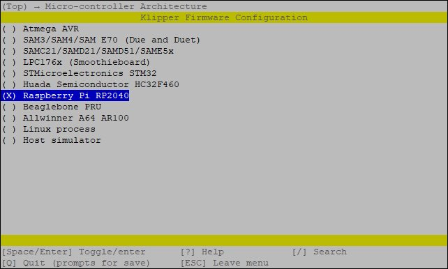
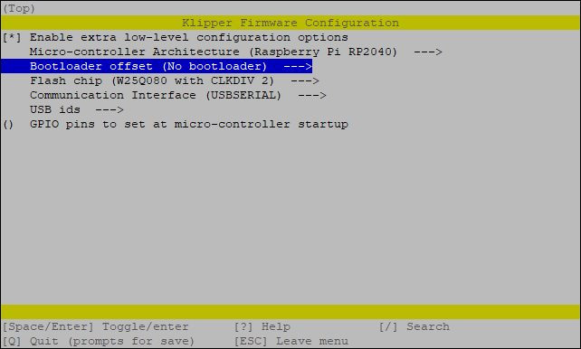
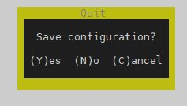
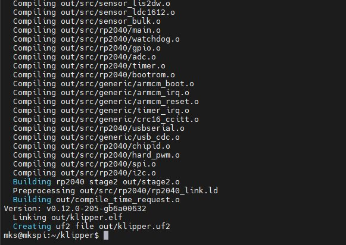
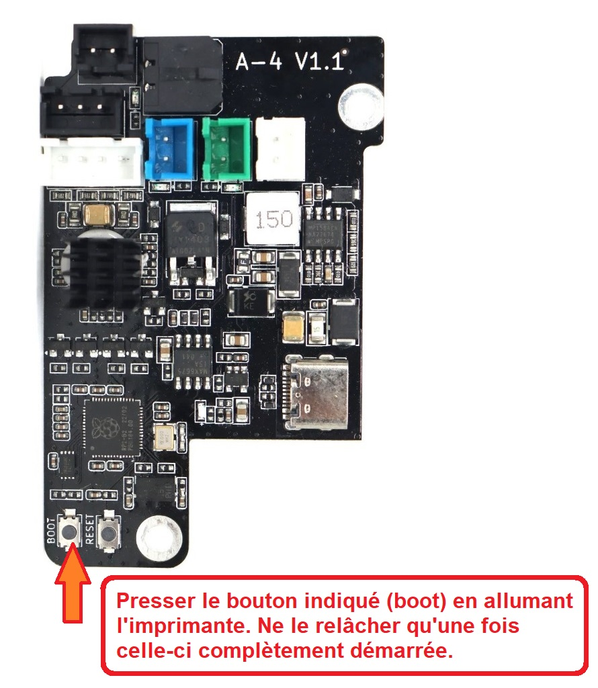
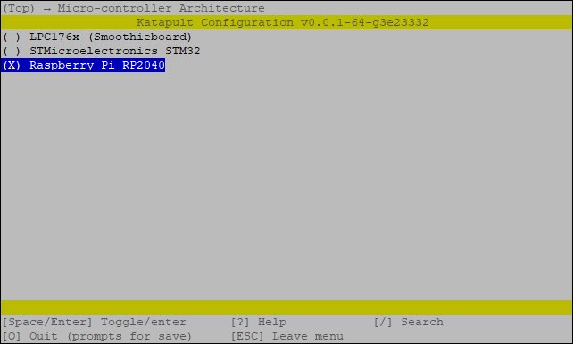
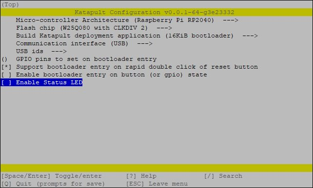
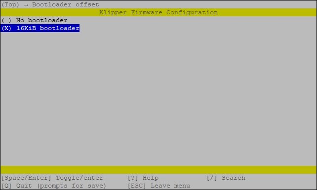
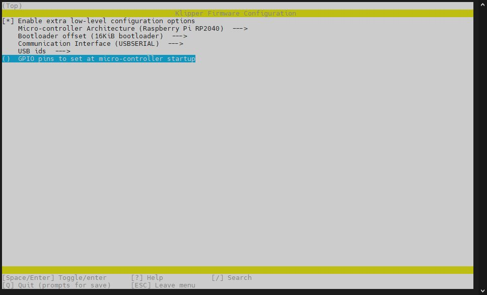

# PRÉPARATION / INSTALLATION (flashage) du FIRMWARE KLIPPER

## SOURCES

Les sources m'ayant servi à la rédaction des tutoriels :
- Mark Ewert, @melvenx, a réalisé [ce document PDF](https://github.com/melvenx/QIDI/blob/main/How%20to%20Update%20Klipper%20for%20the%20QIDI%20Tech%20XMAX3%20XPLUS3%20XSMART3%20Printers%20v2.pdf) relatant les étapes pour flasher les firmwares avec l'OS originel de Qidi (Armbian Buster de Makerbase)). Il est le premier, à ma connaissance, à avoir révéler le nom «spécifique» du fichier à utiliser pour flasher Klipper sur le micro-contrôleur STM32F401 ( **X_4.bin** ), étape primordiale pour réussir les flashages divers.
- Un site [OpenQIDI](https://openqidi.com) avait, dans un premier temps, mis à disposition une documentation (livre) supprimée depuis par l'utilisateur @phill1988 qui a remis à disposition cette documentation sur ce dépôt [FreeQidi](https://github.com/Phil1988/FreeQIDI)
- @leadustin a ensuite fourni une documentation plus étoffée d'abord en langue allemande puis [en anglais](https://github.com/leadustin/QIDI-up2date-english)
- un des développeurs chargé chez Qidi de l'écosystème Klipper ( @cchen616 ) décrit les étapes essentielles dans [cette issue Github](https://github.com/QIDITECH/QIDI_PLUS3/issues/27#issuecomment-2073932891) (à partir de l'OS originel (Armbian buster)).

## FIRMWARE GÉNÉRALITÉS

Pour chacun des contrôleurs :
- principal (MCU),
- secondaire (la tête «MKS-THR»)
- le Linux MCU), les étapes à suivre sont quasi identiques:

- se placer dans le répertoire Klipper du dossier personnel de l'utilisateur «mks»

`cd ~/klipper` ou `cd /home/mks/klipper` ou si on est déjà dans le dossier perso `cd klipper` ou `cd ./klipper`
- configurer le firmware

`make menuconfig`
- dans la fenêtre de configuration, sélectionner les paramètres adéquats (dépend de chaque MCU)
- préparer la compilation

 `make clean`
- compiler

`make`

ou encore, le microcontrôleur RK3328 possèdant plusieurs coeurs, utiliser une compilation parallèle

`make -j4`
- à l'issue de la compilation, récupérer le firmware dans le dossier **out** (~/klipper/out/). Le nom du fichier compilé dépend des directives de compilation ( klipper.bin / klipper.uf2 / klipper.elf )
- flasher ce firmware sur le MCU ( la méthode dépend du MCU à flasher )

Connaissant le principe, on va pouvoir entrer dans les détails.

## PRÉREQUIS

Quelques outils sont nécessaires:
- clé Allen (Hexagonale) 2.0 mm
- carte μSD, clé USB ou adaptateur USB/μSD
- logiciels:
  - pour l'accès distant (SSH)
  - pour le transfert de fichiers entre matériels en réseau
 
## PRÉPARATION MATÉRIELLE

> [!NOTE]
>
> Imprimante **éteinte**
> 

- accéder à l'arrière de l'imprimante pour retirer les vis du capot renfermant l'électronique à l'aide de la clé Allen de 2.0 mm
- retirer ce capot (le ventilateur de refroidissement de la carte y est fixé)
- toujours à l'aide de la clé Allen de 2.0mm, retirer les quatre vis de fixation du capot arrière de la tête pour pouvoir accéder à la carte fille «MKS-THR», sérigraphiée A-4

> [!NOTE]
>
> Mettre sous tension l'imprimante
>

- accéder via un client SSH à l'imprimante via son adresse IP
- se connecter en utilisateur **mks** (mot de passe par défaut si inchangé: ***makerbase***)
- se déplacer dans le dossier klipper

  `cd klipper`
- vérifier que l'on est dans le dossier correct

  `pwd`
  
## MCU PRINCIPAL

## MCU Linux (controleur de la carte X-4 / X-6, Rockchip RK3328)

## MCU tête (carte A-4. controleur RP2040)

Ici, le firmware Klipper peut être installé de deux façons:
1. la première nécessitera à chaque flashage / reflashage le démontage du capot arrière de la tête pour accéder au bouton poussoir «BOOTSEL» permettant de passer le controleur RP2040 en mode émulation de stockage
2. la seconde ne demandera l'étape ci-dessus qu'une seule fois pour l'installation d'un chargeur de démarrage permettant ensuite le flashage du controleur RP2040 via USB. Elle nécessite par contre l'installation supplémentaire du logiciel KATAPULT (ex CANBOOT) de @arksine

### Méthode 1

Connecté en ssh, lancer la suite de commandes:
```
cd ~/klipper
make clean
make menuconfig
```
Le menu de configuration du firmware apparait, choisir les options :
- cocher «Enable extra low-level»
- RP2040 comme contrôleur
<details>
<summary>choix RP2040</summary>
 


</details>

- Pas de chargeur de démarrage
- USB comme interface de communication

<details>
<summary>Au final</summary>


 
</details>

- une fois ces options sélectionnées, presser Q pour sortir de ce menu, valider par Y pour sauvegarder la configuration



- compiler le firmware `make` ou en profitant de plusieurs coeurs du contrôleur RK3328 `make -j4`
- attendre que le proccesus se termine
<details>
<summary>Extrait de la compilation</summary>

 

</details>  

Le firmware a été compilé dans le dossier ~/klipper/out et porte le nom **klipper.uf2**

#### Flasher le firmware klipper.uf2

Pour flasher ce firmware, le contrôleur RP2040 doit passer en mode émulation du stockage.
- éteindre l'imprimante et patienter au moins 30 secondes le temps que le supercondensateur se décharge complètement.
- le capot arrière de la tête étant démonté, presser et maintenir enfoncé le bouton au bas de la carte nommé **BOOT** et allumer l'imprimante.
**Ne pas relâcher la pression sur ce bouton  tant que l'imprimante n'a pas complètement démarré. 


- Relâcher le bouton BOOT quand la lumière interne de l'imprimante s'allume ou une fois l'écran affichant un problème de démarrage car le système d'exploitation ne comporte plus les logiciels permettant la communication entre la carte et l'écran et donc le firmware de l'écran considère qu'il y a un problème 😏
- Se (re)connecter en ssh en utilisateur ***mks***
- Vérifier que le RP2040 est bien en mode émulation de stockage `lsblk` doit afficher un périphérique sda (partition sda1), évcentuellement ce pourrait être sdb (sdb1)
- Si aucun périphérique sda1 (sdb1) n'apaarait à la suite de la commande `lsblk`, presser en maintenant enfoncé lez bouton BOOT, presser et rel'acher le bouton RESET, relâcher le bouton BOOT. Vérifier à nouveau avec un `lsblk`
- Si l'automontage de clé USB a été ajouté au système, copier le firmware sur l'emplacement émulant le stockage du RP2040:
  - `cp ~/klipper/out/klipper.uf2 ~/printer_data/gcodes/USB`

- Sinon, il faudra d'abord monter le stockage :
```
sudo mount /dev/sda1 /mnt
sudo systemctl daemon-relaod
```
Puis procéder au «flashage» via copie du firmware
```
sudo cp /home/mks/klipper/out/*klipper.uf2 /mnt
sudo umount /mnt
```

### Méthode 2

Connecté en ssh, lancer la suite de commandes:

#### Installation de KATAPULT (ex CANBOOT)

- Cloner le dépôt :

`git clone https://github.com/Arksine/katapult`
- préparer la configuration

```
cd ~/katapult
make menuconfig
```

- choisir les options
  - Raspberry Pi RP2040
  - build Katapult deployment application (16 KiB booloader)
  - communication interface (USB)

<details>
<summary>choix à réaliser</summary>
 




</details>

- Presser Q puis Yes pour sauvegarder la configuration
- compiler le firmware Klipper

```
make clean
make -j4
```

- A l'issue de la compilation, le firmware katapult est prêt à être installé

- une fois katapult installé comme chargeur de démarrage, reste à compiler le firmware Klipper et à l'installer
- la préparation `make menuconfig` est similaire à la méthode 1, **la seule différence étant d'indiquer que Klipper doit s'installer avec un décalage en mémoire prenant en compte le chargeur de démarrage (bootloader) de Katapult**

<details>
<summary>RP2040, bootloader de 16 Kio</summary>



pour obtenir au final


 
</details>  

```
cd ~/klipper
make clean
make menuconfig
```
Le menu de configuration du firmware apparait, choisir les options :
- cocher «Enable extra low-level»
- RP2040 comme contrôleur


- Pas de chargeur de démarrage
- USB comme interface de communication

Les options doivent correspondre à :


- une fois ces options sélectionnées, presser Q pour sortir de ce menu, valider par Y pour sauvegarder la configuration


- compiler le firmware `make` ou en profitant de plusieurs coeurs du contrôleur RK3328 `make -j4`
- attendre que le proccesus se termine
<details>
<summary>Extrait de la compilation</summary>

 

</details>  

Le firmware a été compilé dans le dossier ~/klipper/out et porte le nom **klipper.uf2**

#### Flasher le firmware klipper.uf2

Pour flasher ce firmware, le contrôleur RP2040 doit passer en mode émulation du stockage.
- éteindre l'imprimante et patienter au moins 30 secondes le temps que le supercondensateur se décharge complètement.
- le capot arrière de la tête étant démonté, presser et maintenir enfoncé le bouton au bas de la carte nommé **BOOT** et allumer l'imprimante.
**Ne pas relâcher la pression sur ce bouton  tant que l'imprimante n'a pas complètement démarré. 


- Relâcher le bouton BOOT quand la lumière interne de l'imprimante s'allume ou une fois l'écran affichant un problème de démarrage car le système d'exploitation ne comporte plus les logiciels permettant la communication entre la carte et l'écran et donc le firmware de l'écran considère qu'il y a un problème 😏
- Se (re)connecter en ssh en utilisateur ***mks***
- Vérifier que le RP2040 est bien en mode émulation de stockage `lsblk` doit afficher un périphérique sda (partition sda1), évcentuellement ce pourrait être sdb (sdb1)
- Si aucun périphérique sda1 (sdb1) n'apaarait à la suite de la commande `lsblk`, presser en maintenant enfoncé lez bouton BOOT, presser et rel'acher le bouton RESET, relâcher le bouton BOOT. Vérifier à nouveau avec un `lsblk`
- Si l'automontage de clé USB a été ajouté au système, copier le firmware sur l'emplacement émulant le stockage du RP2040:
  - `cp ~/klipper/out/klipper.uf2 ~/printer_data/gcodes/USB`

- Sinon, il faudra d'abord monter le stockage :
```
sudo mount /dev/sda1 /mnt
sudo systemctl daemon-relaod
```
Puis procéder au «flashage» via copie du firmware
```
sudo cp /home/mks/klipper/out/*klipper.uf2 /mnt
sudo umount /mnt
```

