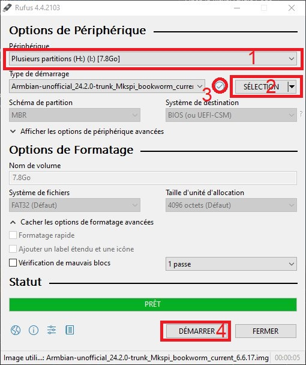
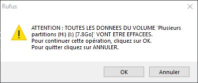
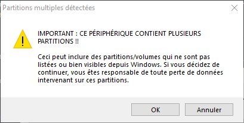

# Installation d'un système plus à jour

> [!IMPORTANT]
> 
> Qidi Tech a choisi pour ses derniers modèles (Series 3 et Q1 Pro) d'utiliser le firmware Klipper. Lors des étapes de développement, leur choix a été de figer les versions des briques de l'écosystème Klipper. En restant sur des versions anciennes mais «identiques» pour tous leurs modèles, cela leur permet d'apporter une maintenance plus aisée qui sinon serait plus difficile à assurer si chacun installait des versions des composants essentiels (Klipper, Moonraker) différentes.
> 
> C'est un point de vue commercial honorable, d'autant plus qu'ầ ce jour, leur SAV est irréprochable.
>
> Honnêtement depuis maintenant plus de neuf mois que j'utilise ma X-Max 3 (*reçue en août 2023*), je n'ai pas rencontré de problèmes majeurs à cause de ces choix logiciels originaux.

## Pourquoi ?

La distribution Linux installée d'origine est une Armbian en version Buster, version passée en fin de vie depuis quelques années déjà. Armbian dont le développement est bénévole, a supprimé depuis quelques mois les dépôts Buster (voir [ici](https://fi.mirror.armbian.de/apt/dists/)). La mise à jour du système remonte des erreurs au sujet de ces dépôts inaccessibles :
```
Ign:5 http://fi.mirror.armbian.de/apt buster InRelease
Err:6 http://fi.mirror.armbian.de/apt buster Release
  404  Not Found [IP: 65.21.120.247 80]
```

Les seules mises à jour disponibles du système ne concernent que celles des dépôts Debian (Armbian est basée sur cette distribution).

<details>

   <summary>Solution provisoire</summary>

```
Commenter la ligne faisant référence au dépôt Buster d'Armbian dans le fichier /etc/apt/sources.list.d/armbian.list

#deb http://apt.armbian.com buster main buster-utils buster-desktop

```
   
</details>

Python cohabite en deux versions (v2 et v3), la v2, passée en fin de vie, il y a plusieurs années désormais, n'est plus supportée. La v3 reste bloquée en version 3.7.

Le Klipper (klippy) proposé par Qidi Tech a été installé avec Python2. Klipper préconise actuellement de construire l'environnement virtuel (klippy) en utilisant Python en version 3.

> [!CAUTION]
> **En suivant ces instructions, vous perdrez la garantie de Qidi Tech**

Au moins deux éléments matériels ne seront plus directement utilisables :
- l'actuel écran tactile,
- l'accès réseau Wifi avec la clé Wifi Tenda.

> [!NOTE]
> Moyennant des achats supplémentaires, on pourra compenser la perte de l'écran originel et du Wifi :
> 
> - Klipperscreen avec un autre écran et un SBC (Small Board Computer) pour piloter l'imprimante
> - Une clé USB Wifi gérée nativement par Armbian ([une bonne liste](https://teamgloomy.github.io/armbian_wifi.html)). Il faudra connaitre précisément le fabricant et la puce (chipset) utilisés.


> [!WARNING]
> Les manipulations décrites ne s'adressent pas à un débutant mais plutôt à un utilisateur ayant un peu d'expérience avec Linux et sa ligne de commandes.
>
> En gros, je n'assume aucune responsabilité en cas de mauvaises manipulations. Ce qui a fonctionné pour moi peut très bien s'avérer un cauchemar pour d'autres… comme disent les anglo-saxons ***YMMV***.
> 
> J'insiste encore:
> Les manipulations décrites sont faites à vos risques et périls. Vous ne devez pas contacter l'assistance QIDI en cas de problème. En effectuant ces modifications, vous perdrez votre garantie à cet égard.
>
> Qidi cependant fournit une image de "récupération" qui permettra de restaurer le système dans l'état où QIDI livre ses imprimantes. Vous n'aurez alors qu'à "rétrograder" (flasher à nouveau le firmware Klipper) sur la tête «THR», le MCU de la carte contrôleur et celui du Linux MCU.
> Vous serez pratiquement revenu au point de départ et vous devriez pouvoir retrouver votre garantie 😃


## Prérequis

Matériel:

- Lecteur eMMC (si achat de l'eMMC de 32Gio de Qidi, un adaptateur μSD est inclus). Je préfère [cet adaptateur là](https://www.aliexpress.com/item/1005005614719377.html).

Logiciels (*à télécharger si nécessaire* (⏬)) :
- ⏬ [Rufus](https://rufus.ie/fr/) ou ⏬ [BalenaEtcher](https://etcher.balena.io/) ou encore ⏬ [Raspberry Imager](https://www.raspberrypi.com/software/) (au choix)
- ⏬ [image récente du système Armbian](https://github.com/redrathnure/armbian-mkspi/releases/tag/mkspi%2F0.3.4-24.2.0-trunk) (*au moment de la rédaction de  cette documentation (20240402), j'utilise cette version (Bookworm (24.2.0), noyau (6.6.17)* )
  - Merci à [@redrathnure](https://github.com/redrathnure/armbian-mkspi) qui a réalisé l'image du système Armbian récent
- accès SSH (⏬ [Putty](https://putty.org/), ⏬ [MobaXterm](https://mobaxterm.mobatek.net/), …)
- transfert de fichier (⏬ [WinSCP](https://winscp.net/eng/index.php) )
- archiveur de fichiers ⏬ [7zip](https://7-zip.org/) 

## Préalable

> [!IMPORTANT]
> 
> **Le système d'exploitation sera complètement remplacé par un plus récent**
   
>[!TIP]
>
> Avant toute chose, il est préférable d'avoir réalisé une sauvegarde de la totalité des dossiers:
> - ~/klipper_config (contient les fichiers de configuration)
> - ~/gcode_files (contient les G-codes).

Une fois ces précautions prises :
- éteindre l'imprimante et débrancher le câble d'alimentation
- accéder à l'arrière pour démonter la plaque donnant accès à la partie électronique
- dévisser les deux vis maintenant l'eMMC sur la carte et extraire celle-ci (on peut évidemment se mettre à la terre avant de faire  ces manipulations 😏 ). Qidi met à disposition [cette vidéo](https://drive.google.com/drive/folders/1EPYKbYz4ecUIf17z5wtP-jDAOPeDkXJP) montrant la procédure.


## Installation Armbian Bookworm

### Sur le «PC»

- connecter l'eMMC à l'aide de son adaptateur sur le PC de travail
- démarrer Rufus pour flasher l'image Armbian précédemment téléchargée (***au moment de la rédaction : Armbian-unofficial_24.2.0-trunk_Mkspi_bookworm_current_6.6.17.img.xz***) puis décompressée via 7zip pour obtenir le fichier d'extension .img (Armbian-unofficial_24.2.0-trunk_Mkspi_bookworm_current_6.6.17.img)



  * sélectionner le périphérique contenant l'eMMC (1)
  * indiquer l'emplacement du ficher .img (2)
  * (3) permet de vérifier l'intégrité du fichier téléchargé (le fichier .sha du dépôt Github contient l'empreinte)
  * lancer le processus de flashage

Deux fenêtres d'alerte vont s'afficher, cliquer sur OK pour valider et poursuivre le flashage




La procédure dure un certain temps (moins de dix minutes), la progression de la tâche s'affiche au fur et à mesure


et finalement, cette barre de progression passe au vert:


retirer alors le lecteur contenant l'eMMC via la procédure standard pour l'éjecter proprement du PC 

### Sur l'imprimante

- réinsérer l'eMMC sur la carte contrôleur de l'imprimante (voir la vidéo citée plus haut)
- brancher le câble d'alimentation et **le câble Ethernet** (rappel: la clé Wifi Tenda n'est plus fonctionnelle)
- allumer l'imprimante (le système démarre, une adresse IP est attribuée (Box internet, routeur)
  - le firmware indépendant de l'écran ne pouvant plus communiquer avec le système (absence des «logiciels» le permettant), l'écran affiche ceci :
  - 
- récupérer l'adresse IP par le moyen qui convient (Box internet, routeur, logiciel type [AngryIP](https://angryip.org/)
- démarrer le logiciel SSH (Putty, SSH natif, Mobaxterm, …) et accéder à l'imprimante via son adresse IP
- le premier accès se fait en tant qu'utilisateur "**root**", mot de passe "**1234**". Cette première connexion lance le setup initial du systéme Armbian (changer le mot de passe "root", choisir la zone horaire, choisir le shell entre autre)
- ensuite il est demandé de créer un nouvel utilisateur ( par exemple: "**mks**", mot de passe "***makerbase***" ), confirmer par ENTRÉE
- la zone horaire (timezone) ayant été détectée (Europe/Paris), l'installateur propose de générer les locales. Plusieurs choix étant possible, je sélectionne le 4 (fr_FR.UTF-8)
- à l'aide du logiciel SSH, ouvrir une nouvelle session en tant que le nouvel utilisateur créé ( "**mks**" )
- mettre à jour le système :

```sh
sudo apt update
sudo apt upgrade
```
ou en une seule ligne
```sh
sudo apt update && sudo apt upgrade
```
Confirmer la mise à jour (manuellement) ou ajouter le paramètre "-y" à la suite de "upgrade" 
```sh
sudo apt upgrade -y
```

Le système de base est installé sur l'eMMC, il occupe moins de 2Gio sur la capacité totale de 8Gio

```
mks@mkspi:~$ df -h
Sys. de fichiers Taille Utilisé Dispo Uti% Monté sur
udev               379M       0  379M   0% /dev
tmpfs               92M    2,0M   90M   3% /run
/dev/mmcblk1p2     6,7G    1,9G  4,8G  29% /
tmpfs              456M       0  456M   0% /dev/shm
tmpfs              5,0M       0  5,0M   0% /run/lock
tmpfs              456M       0  456M   0% /tmp
/dev/mmcblk1p1     256M     88M  169M  35% /boot
/dev/zram1          47M    740K   43M   2% /var/log
tmpfs               92M       0   92M   0% /run/user/1000
```

[La documentation suivante](./installation-ecosysteme-klipper.md) permet de poursuivre l'installation de l'écosystème Klipper

😃
