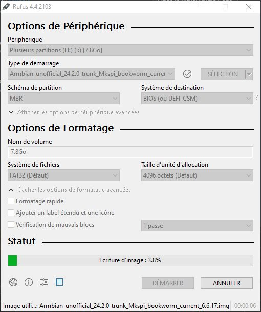
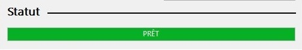

# Installation d'un système plus à jour

## Prérequis

Matériel:

- Lecteur eMMC (si achat de l'eMMC de 32Gio de Qidi, un adaptateur μSD est inclus). Je préfère ce lecteur là.

Logiciels:
- [Rufus](https://rufus.ie/fr/), [BalenaEtcher](https://etcher.balena.io/), [Raspberry Imager](https://www.raspberrypi.com/software/) (au choix)
- [image récente du système Armbian](https://github.com/redrathnure/armbian-mkspi/releases/tag/mkspi%2F0.3.4-24.2.0-trunk) (au moment de la rédaction de  cette documentation (20240402), j'utilise cette version (Bookworm (24.2.0), noyau (6.6.17) )
- accès SSH ([Putty](https://putty.org/), [MobaXterm](https://mobaxterm.mobatek.net/), …)
- transfert de fichier ([WinSCP](https://winscp.net/eng/index.php)
- archiveur de fichiers [7zip](https://7-zip.org/) 

## Préalable

**Le système d'exploitation sera complètement remplacé par un plus récent**, il est donc nécessaire de sauvegarder la totalité du dossier ~/klipper_config (contient les fichiers de configuration) et ~/gcode_files (contient les G-codes).

- éteindre l'imprimante et débrancher le câble d'alimentation
- accéder à l'arrière pour démonter la plaque donnant accès à la partie électronique
- dévisser les deux vis maintenant l'eMMC sur la carte et extraire celle-ci (on peut évidemment se mettre à la terre avant de le faire :smiley: ). Qidi met à disposition [cette vidéo](https://drive.google.com/drive/folders/1EPYKbYz4ecUIf17z5wtP-jDAOPeDkXJP) montrant la procédure.


## Installation Armbian Bookworm

- connecter l'eMMC à l'aide de son adaptateur sur le PC de travail
- démarrer Rufus pour flasher l'image Armbian précédemment téléchargée (au moment de la rédaction : Armbian-unofficial_24.2.0-trunk_Mkspi_bookworm_current_6.6.17.img.xz) puis décompressée via 7zip pour obtenir le fichier d'extension .img (Armbian-unofficial_24.2.0-trunk_Mkspi_bookworm_current_6.6.17.img)


  * sélectionner le périphérique contenant l'eMMC (1)
  * indiquer l'emplacement du ficher .img (2)
  * (3) permet de vérifier l'intégrité du fichier téléchargé (le fichier .sha du dépôt Github contient l'empreinte)
  * lancer le processus de flashage
Deux fenêtres d'alerte vont s'afficher, cliquer sur OK pour valider et poursuivre le flashage


La procédure dure un certain temps (moins de cinq minutes), la progression de la tâche s'affiche



Une fois terminé, le nom du périphérique est affiché (armbi_boot)



Retirer le lecteur contenant l'eMMC du PC via la procédure standard pour l'éjecter proprement

- réinsérer l'eMMC sur la carte contrôleur de l'imprimante (voir la vidéo citée plus haut)
- brancher le câble d'alimentation et le câble Ethernet
- allumer l'imprimante (le système démarre, une adresse IP est attribuée (Box internet, routeur)
- récupérer l'adresse IP par le moyen qui convient (Box internet, routeur, logiciel type [AngryIP](https://angryip.org/)
- démarrer le logiciel SSH (Putty, SSH natif, Mobaxterm, …) et accéder à l'imprimante via son adresse IP
- l'accès se fait en tant qu'utilisateur "root", mot de passe "1234". La première connexion lance le setup initial du systéme Armbian (changer le mot de passe "root", choix de la zone horaire, choix du shell entre autre)
- créer un nouvel utilisateur "mks", mot de passe "makerbase", par exemple, confirmer par ENTRÉE
- la zone horaire (timezone) ayant été détectée (Europe/Paris), l'installateur propose de générer les locales. Plusieurs choix étant possible, je sélectionne le 4 (fr_FR.UTF-8)
- à l'aide du logiciel SSH, ouvrir une nouvelle session en tant que le nouvel utilisateur créé ( "mks" )
- mettre à jour le système :

```
sudo apt update
sudo apt upgrade
```
ou en une seule ligne
```
sudo apt update && sudo apt upgrade
```
Confirmer la mise à jour (manuellement) ou ajouter le paramètre "-y" à la suite de "upgrade" 
```
sudo apt upgrade -y
```

[La documentation suivante](./installation-ecosysteme-klipper.md) permet de poursuivre l'installation de l'écosystème Klipper

:smiley:
