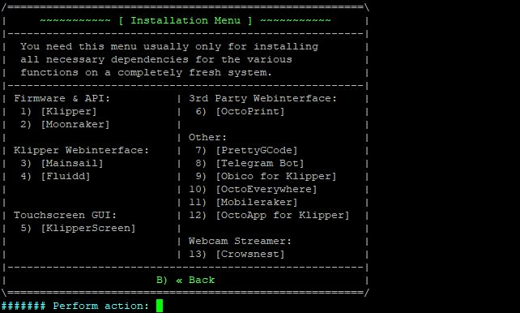

# Installation de KIAUH (Klipper Installation And Update Helper)

Un ensemble de scripts permet une installation facilitée des éléments composants l'«écosysteme Klipper». Grâce à celui-ci, il est possible d'installer, mettre à jour, supprimer des éléments de la suite.

Il suffit simplement de récupérer le dépôt Github de cet outil puis d'exécuter son script shell.

1. installer le paquet "git"
```
sudo apt update && sudo apt install git -y
```
2. cloner le dépôt
```
cd && git clone https://github.com/dw-0/kiauh.git
```
<details>
 <summary>(Détails de l'installation)</summary>
 
```
mks@mkspi:~$ cd && git clone https://github.com/dw-0/kiauh.git
Clonage dans 'kiauh'...
remote: Enumerating objects: 5584, done.
remote: Counting objects: 100% (5584/5584), done.
remote: Compressing objects: 100% (1673/1673), done.
remote: Total 5584 (delta 4043), reused 5274 (delta 3879), pack-reused 0
Réception d'objets: 100% (5584/5584), 1.46 Mio | 4.99 Mio/s, fait.
Résolution des deltas: 100% (4043/4043), fait.
```
  
</details>

3. Exécuter le script
```
~/kiauh/kiauh.sh
```

La première fenêtre donne accès au menu principal de KIAUH


Rien n'est encore installé. Choisir l'option 1 pour accéder au menu des installations


Installer dans l'ordre :
1. Klipper
2. Moonraker
3. Mainsail
4. Fluidd (port 10088)

### Klipper

Aprés sélection (1), choisir la version de Python (v3 recommandée)


Nombre d'instances de Klipper (plusieurs imprimantes)


<details>
  <summary>(Installation détaillée)</summary>
    
```
###### Installing single Klipper instance ...

###### Checking for the following dependencies:
● git
[✓ OK] Dependencies already met!

###### Cloning Klipper from https://github.com/Klipper3d/klipper ...
Clonage dans '/home/mks/klipper'...
remote: Enumerating objects: 60918, done.
remote: Counting objects: 100% (311/311), done.
remote: Compressing objects: 100% (164/164), done.
remote: Total 60918 (delta 237), reused 178 (delta 139), pack-reused 60607
Réception d'objets: 100% (60918/60918), 171.75 Mio | 5.25 Mio/s, fait.
Résolution des deltas: 100% (48823/48823), fait.
Mise à jour des fichiers: 100% (2129/2129), fait.
Déjà sur 'master'
Votre branche est à jour avec 'origin/master'.

###### Reading dependencies...
virtualenv
python3-dev
libffi-dev
build-essential
libncurses-dev
libusb-dev
avrdude
gcc-avr
binutils-avr
avr-libc
stm32flash
libnewlib-arm-none-eabi
gcc-arm-none-eabi
binutils-arm-none-eabi
libusb-1.0
pkg-config
dfu-util

###### Installing packages...
Lecture des listes de paquets... Fait
Construction de l'arbre des dépendances... Fait
Lecture des informations d'état... Fait
Note : sélection de libusb-1.0-0-dev pour l'expression rationnelle « libusb-1.0 »
Note : sélection de libusb-1.0-doc pour l'expression rationnelle « libusb-1.0 »
Note : sélection de libusb-1.0-0 pour l'expression rationnelle « libusb-1.0 »
build-essential est déjà la version la plus récente (12.9).
libusb-1.0-0 est déjà la version la plus récente (2:1.0.26-1).
libusb-1.0-0 passé en « installé manuellement ».
Les paquets supplémentaires suivants seront installés :
  libexpat1-dev libftdi1 libhidapi-libusb0 libjs-jquery libjs-sphinxdoc
  libjs-underscore libncurses6 libnewlib-dev libpkgconf3 libpython3-dev
  libpython3.11 libpython3.11-dev libusb-0.1-4 pkgconf pkgconf-bin
  python3-distlib python3-filelock python3-pip-whl python3-platformdirs
  python3-setuptools-whl python3-virtualenv python3-wheel-whl python3.11-dev
Paquets suggérés :
  dfu-programmer avrdude-doc gcc-doc ncurses-doc libnewlib-doc
Paquets recommandés :
  javascript-common libstdc++-arm-none-eabi-newlib
Les NOUVEAUX paquets suivants seront installés :
  avr-libc avrdude binutils-arm-none-eabi binutils-avr dfu-util
  gcc-arm-none-eabi gcc-avr libexpat1-dev libffi-dev libftdi1
  libhidapi-libusb0 libjs-jquery libjs-sphinxdoc libjs-underscore
  libncurses-dev libncurses6 libnewlib-arm-none-eabi libnewlib-dev libpkgconf3
  libpython3-dev libpython3.11 libpython3.11-dev libusb-0.1-4 libusb-1.0-0-dev
  libusb-1.0-doc libusb-dev pkg-config pkgconf pkgconf-bin python3-dev
  python3-distlib python3-filelock python3-pip-whl python3-platformdirs
  python3-setuptools-whl python3-virtualenv python3-wheel-whl python3.11-dev
  stm32flash virtualenv
0 mis à jour, 40 nouvellement installés, 0 à enlever et 8 non mis à jour.
Il est nécessaire de prendre 124 Mo dans les archives.
Après cette opération, 1035 Mo d'espace disque supplémentaires seront utilisés.
Réception de :1 http://deb.debian.org/debian bookworm/main arm64 binutils-avr arm64 2.26.20160125+Atmel3.6.2-4 [1395 kB]
Réception de :2 http://deb.debian.org/debian bookworm/main arm64 gcc-avr arm64 1:5.4.0+Atmel3.6.2-3 [14,1 MB]
Réception de :3 http://deb.debian.org/debian bookworm/main arm64 avr-libc all 1:2.0.0+Atmel3.6.2-3 [4889 kB]
Réception de :4 http://deb.debian.org/debian bookworm/main arm64 libusb-0.1-4 arm64 2:0.1.12-32 [21,5 kB]
Réception de :5 http://deb.debian.org/debian bookworm/main arm64 libftdi1 arm64 0.20-4+b1 [18,8 kB]
Réception de :6 http://deb.debian.org/debian bookworm/main arm64 libhidapi-libusb0 arm64 0.13.1-1 [15,3 kB]
Réception de :7 http://deb.debian.org/debian bookworm/main arm64 avrdude arm64 7.1+dfsg-3 [366 kB]
Réception de :8 http://deb.debian.org/debian bookworm/main arm64 binutils-arm-none-eabi arm64 2.40-2+18+b1 [2694 kB]
Réception de :9 http://deb.debian.org/debian bookworm/main arm64 dfu-util arm64 0.11-1 [41,2 kB]
Réception de :10 http://deb.debian.org/debian bookworm/main arm64 gcc-arm-none-eabi arm64 15:12.2.rel1-1 [45,1 MB]
Réception de :11 http://deb.debian.org/debian bookworm/main arm64 libexpat1-dev arm64 2.5.0-1 [135 kB]
Réception de :12 http://deb.debian.org/debian bookworm/main arm64 libffi-dev arm64 3.4.4-1 [56,0 kB]
Réception de :13 http://deb.debian.org/debian bookworm/main arm64 libjs-jquery all 3.6.1+dfsg+~3.5.14-1 [326 kB]
Réception de :14 http://deb.debian.org/debian bookworm/main arm64 libjs-underscore all 1.13.4~dfsg+~1.11.4-3 [116 kB]
Réception de :15 http://deb.debian.org/debian bookworm/main arm64 libjs-sphinxdoc all 5.3.0-4 [130 kB]
Réception de :16 http://deb.debian.org/debian bookworm/main arm64 libncurses6 arm64 6.4-4 [93,9 kB]
Réception de :17 http://deb.debian.org/debian bookworm/main arm64 libncurses-dev arm64 6.4-4 [336 kB]
Réception de :18 http://deb.debian.org/debian bookworm/main arm64 libnewlib-dev all 3.3.0-1.3 [262 kB]
Réception de :19 http://deb.debian.org/debian bookworm/main arm64 libnewlib-arm-none-eabi all 3.3.0-1.3 [43,6 MB]
Réception de :20 http://deb.debian.org/debian bookworm/main arm64 libpkgconf3 arm64 1.8.1-1 [35,3 kB]
Réception de :21 http://deb.debian.org/debian bookworm/main arm64 libpython3.11 arm64 3.11.2-6 [1841 kB]
Réception de :22 http://deb.debian.org/debian bookworm/main arm64 libpython3.11-dev arm64 3.11.2-6 [4395 kB]
Réception de :23 http://deb.debian.org/debian bookworm/main arm64 libpython3-dev arm64 3.11.2-1+b1 [9564 B]
Réception de :24 http://deb.debian.org/debian bookworm/main arm64 libusb-1.0-0-dev arm64 2:1.0.26-1 [83,0 kB]
Réception de :25 http://deb.debian.org/debian bookworm/main arm64 libusb-1.0-doc all 2:1.0.26-1 [193 kB]
Réception de :26 http://deb.debian.org/debian bookworm/main arm64 libusb-dev arm64 2:0.1.12-32 [37,5 kB]
Réception de :27 http://deb.debian.org/debian bookworm/main arm64 pkgconf-bin arm64 1.8.1-1 [28,9 kB]
Réception de :28 http://deb.debian.org/debian bookworm/main arm64 pkgconf arm64 1.8.1-1 [25,9 kB]
Réception de :29 http://deb.debian.org/debian bookworm/main arm64 pkg-config arm64 1.8.1-1 [13,7 kB]
Réception de :30 http://deb.debian.org/debian bookworm/main arm64 python3.11-dev arm64 3.11.2-6 [617 kB]
Réception de :31 http://deb.debian.org/debian bookworm/main arm64 python3-dev arm64 3.11.2-1+b1 [26,2 kB]
Réception de :32 http://deb.debian.org/debian bookworm/main arm64 python3-distlib all 0.3.6-1 [257 kB]
Réception de :33 http://deb.debian.org/debian bookworm/main arm64 python3-filelock all 3.9.0-1 [9460 B]
Réception de :34 http://deb.debian.org/debian bookworm/main arm64 python3-pip-whl all 23.0.1+dfsg-1 [1717 kB]
Réception de :35 http://deb.debian.org/debian bookworm/main arm64 python3-platformdirs all 2.6.0-1 [16,3 kB]
Réception de :36 http://deb.debian.org/debian bookworm/main arm64 python3-setuptools-whl all 66.1.1-1 [1111 kB]
Réception de :37 http://deb.debian.org/debian bookworm/main arm64 python3-wheel-whl all 0.38.4-2 [38,6 kB]
Réception de :38 http://deb.debian.org/debian bookworm/main arm64 python3-virtualenv all 20.17.1+ds-1 [93,9 kB]
Réception de :39 http://deb.debian.org/debian bookworm/main arm64 stm32flash arm64 0.7-1 [31,4 kB]
Réception de :40 http://deb.debian.org/debian bookworm/main arm64 virtualenv all 20.17.1+ds-1 [21,1 kB]
124 Mo réceptionnés en 13s (9570 ko/s)
Extracting templates from packages: 100%
Sélection du paquet binutils-avr précédemment désélectionné.
(Lecture de la base de données... 68159 fichiers et répertoires déjà installés.)
Préparation du dépaquetage de .../00-binutils-avr_2.26.20160125+Atmel3.6.2-4_arm64.deb ...
Dépaquetage de binutils-avr (2.26.20160125+Atmel3.6.2-4) ...
Sélection du paquet gcc-avr précédemment désélectionné.
Préparation du dépaquetage de .../01-gcc-avr_1%3a5.4.0+Atmel3.6.2-3_arm64.deb ...
Dépaquetage de gcc-avr (1:5.4.0+Atmel3.6.2-3) ...
Sélection du paquet avr-libc précédemment désélectionné.
Préparation du dépaquetage de .../02-avr-libc_1%3a2.0.0+Atmel3.6.2-3_all.deb ...
Dépaquetage de avr-libc (1:2.0.0+Atmel3.6.2-3) ...
Sélection du paquet libusb-0.1-4:arm64 précédemment désélectionné.
Préparation du dépaquetage de .../03-libusb-0.1-4_2%3a0.1.12-32_arm64.deb ...
Dépaquetage de libusb-0.1-4:arm64 (2:0.1.12-32) ...
Sélection du paquet libftdi1:arm64 précédemment désélectionné.
Préparation du dépaquetage de .../04-libftdi1_0.20-4+b1_arm64.deb ...
Dépaquetage de libftdi1:arm64 (0.20-4+b1) ...
Sélection du paquet libhidapi-libusb0:arm64 précédemment désélectionné.
Préparation du dépaquetage de .../05-libhidapi-libusb0_0.13.1-1_arm64.deb ...
Dépaquetage de libhidapi-libusb0:arm64 (0.13.1-1) ...
Sélection du paquet avrdude précédemment désélectionné.
Préparation du dépaquetage de .../06-avrdude_7.1+dfsg-3_arm64.deb ...
Dépaquetage de avrdude (7.1+dfsg-3) ...
Sélection du paquet binutils-arm-none-eabi précédemment désélectionné.
Préparation du dépaquetage de .../07-binutils-arm-none-eabi_2.40-2+18+b1_arm64.deb ...
Dépaquetage de binutils-arm-none-eabi (2.40-2+18+b1) ...
Sélection du paquet dfu-util précédemment désélectionné.
Préparation du dépaquetage de .../08-dfu-util_0.11-1_arm64.deb ...
Dépaquetage de dfu-util (0.11-1) ...
Sélection du paquet gcc-arm-none-eabi précédemment désélectionné.
Préparation du dépaquetage de .../09-gcc-arm-none-eabi_15%3a12.2.rel1-1_arm64.deb ...
Dépaquetage de gcc-arm-none-eabi (15:12.2.rel1-1) ...
Sélection du paquet libexpat1-dev:arm64 précédemment désélectionné.
Préparation du dépaquetage de .../10-libexpat1-dev_2.5.0-1_arm64.deb ...
Dépaquetage de libexpat1-dev:arm64 (2.5.0-1) ...
Sélection du paquet libffi-dev:arm64 précédemment désélectionné.
Préparation du dépaquetage de .../11-libffi-dev_3.4.4-1_arm64.deb ...
Dépaquetage de libffi-dev:arm64 (3.4.4-1) ...
Sélection du paquet libjs-jquery précédemment désélectionné.
Préparation du dépaquetage de .../12-libjs-jquery_3.6.1+dfsg+~3.5.14-1_all.deb ...
Dépaquetage de libjs-jquery (3.6.1+dfsg+~3.5.14-1) ...
Sélection du paquet libjs-underscore précédemment désélectionné.
Préparation du dépaquetage de .../13-libjs-underscore_1.13.4~dfsg+~1.11.4-3_all.deb ...
Dépaquetage de libjs-underscore (1.13.4~dfsg+~1.11.4-3) ...
Sélection du paquet libjs-sphinxdoc précédemment désélectionné.
Préparation du dépaquetage de .../14-libjs-sphinxdoc_5.3.0-4_all.deb ...
Dépaquetage de libjs-sphinxdoc (5.3.0-4) ...
Sélection du paquet libncurses6:arm64 précédemment désélectionné.
Préparation du dépaquetage de .../15-libncurses6_6.4-4_arm64.deb ...
Dépaquetage de libncurses6:arm64 (6.4-4) ...
Sélection du paquet libncurses-dev:arm64 précédemment désélectionné.
Préparation du dépaquetage de .../16-libncurses-dev_6.4-4_arm64.deb ...
Dépaquetage de libncurses-dev:arm64 (6.4-4) ...
Sélection du paquet libnewlib-dev précédemment désélectionné.
Préparation du dépaquetage de .../17-libnewlib-dev_3.3.0-1.3_all.deb ...
Dépaquetage de libnewlib-dev (3.3.0-1.3) ...
Sélection du paquet libnewlib-arm-none-eabi précédemment désélectionné.
Préparation du dépaquetage de .../18-libnewlib-arm-none-eabi_3.3.0-1.3_all.deb ...
Dépaquetage de libnewlib-arm-none-eabi (3.3.0-1.3) ...
Sélection du paquet libpkgconf3:arm64 précédemment désélectionné.
Préparation du dépaquetage de .../19-libpkgconf3_1.8.1-1_arm64.deb ...
Dépaquetage de libpkgconf3:arm64 (1.8.1-1) ...
Sélection du paquet libpython3.11:arm64 précédemment désélectionné.
Préparation du dépaquetage de .../20-libpython3.11_3.11.2-6_arm64.deb ...
Dépaquetage de libpython3.11:arm64 (3.11.2-6) ...
Sélection du paquet libpython3.11-dev:arm64 précédemment désélectionné.
Préparation du dépaquetage de .../21-libpython3.11-dev_3.11.2-6_arm64.deb ...
Dépaquetage de libpython3.11-dev:arm64 (3.11.2-6) ...
Sélection du paquet libpython3-dev:arm64 précédemment désélectionné.
Préparation du dépaquetage de .../22-libpython3-dev_3.11.2-1+b1_arm64.deb ...
Dépaquetage de libpython3-dev:arm64 (3.11.2-1+b1) ...
Sélection du paquet libusb-1.0-0-dev:arm64 précédemment désélectionné.
Préparation du dépaquetage de .../23-libusb-1.0-0-dev_2%3a1.0.26-1_arm64.deb ...
Dépaquetage de libusb-1.0-0-dev:arm64 (2:1.0.26-1) ...
Sélection du paquet libusb-1.0-doc précédemment désélectionné.
Préparation du dépaquetage de .../24-libusb-1.0-doc_2%3a1.0.26-1_all.deb ...
Dépaquetage de libusb-1.0-doc (2:1.0.26-1) ...
Sélection du paquet libusb-dev précédemment désélectionné.
Préparation du dépaquetage de .../25-libusb-dev_2%3a0.1.12-32_arm64.deb ...
Dépaquetage de libusb-dev (2:0.1.12-32) ...
Sélection du paquet pkgconf-bin précédemment désélectionné.
Préparation du dépaquetage de .../26-pkgconf-bin_1.8.1-1_arm64.deb ...
Dépaquetage de pkgconf-bin (1.8.1-1) ...
Sélection du paquet pkgconf:arm64 précédemment désélectionné.
Préparation du dépaquetage de .../27-pkgconf_1.8.1-1_arm64.deb ...
Dépaquetage de pkgconf:arm64 (1.8.1-1) ...
Sélection du paquet pkg-config:arm64 précédemment désélectionné.
Préparation du dépaquetage de .../28-pkg-config_1.8.1-1_arm64.deb ...
Dépaquetage de pkg-config:arm64 (1.8.1-1) ...
Sélection du paquet python3.11-dev précédemment désélectionné.
Préparation du dépaquetage de .../29-python3.11-dev_3.11.2-6_arm64.deb ...
Dépaquetage de python3.11-dev (3.11.2-6) ...
Sélection du paquet python3-dev précédemment désélectionné.
Préparation du dépaquetage de .../30-python3-dev_3.11.2-1+b1_arm64.deb ...
Dépaquetage de python3-dev (3.11.2-1+b1) ...
Sélection du paquet python3-distlib précédemment désélectionné.
Préparation du dépaquetage de .../31-python3-distlib_0.3.6-1_all.deb ...
Dépaquetage de python3-distlib (0.3.6-1) ...
Sélection du paquet python3-filelock précédemment désélectionné.
Préparation du dépaquetage de .../32-python3-filelock_3.9.0-1_all.deb ...
Dépaquetage de python3-filelock (3.9.0-1) ...
Sélection du paquet python3-pip-whl précédemment désélectionné.
Préparation du dépaquetage de .../33-python3-pip-whl_23.0.1+dfsg-1_all.deb ...
Dépaquetage de python3-pip-whl (23.0.1+dfsg-1) ...
Sélection du paquet python3-platformdirs précédemment désélectionné.
Préparation du dépaquetage de .../34-python3-platformdirs_2.6.0-1_all.deb ...
Dépaquetage de python3-platformdirs (2.6.0-1) ...
Sélection du paquet python3-setuptools-whl précédemment désélectionné.
Préparation du dépaquetage de .../35-python3-setuptools-whl_66.1.1-1_all.deb ...
Dépaquetage de python3-setuptools-whl (66.1.1-1) ...
Sélection du paquet python3-wheel-whl précédemment désélectionné.
Préparation du dépaquetage de .../36-python3-wheel-whl_0.38.4-2_all.deb ...
Dépaquetage de python3-wheel-whl (0.38.4-2) ...
Sélection du paquet python3-virtualenv précédemment désélectionné.
Préparation du dépaquetage de .../37-python3-virtualenv_20.17.1+ds-1_all.deb ...
Dépaquetage de python3-virtualenv (20.17.1+ds-1) ...
Sélection du paquet stm32flash précédemment désélectionné.
Préparation du dépaquetage de .../38-stm32flash_0.7-1_arm64.deb ...
Dépaquetage de stm32flash (0.7-1) ...
Sélection du paquet virtualenv précédemment désélectionné.
Préparation du dépaquetage de .../39-virtualenv_20.17.1+ds-1_all.deb ...
Dépaquetage de virtualenv (20.17.1+ds-1) ...
Paramétrage de binutils-avr (2.26.20160125+Atmel3.6.2-4) ...
Paramétrage de python3-setuptools-whl (66.1.1-1) ...
Paramétrage de python3-filelock (3.9.0-1) ...
Paramétrage de binutils-arm-none-eabi (2.40-2+18+b1) ...
Paramétrage de libpython3.11:arm64 (3.11.2-6) ...
Paramétrage de python3-pip-whl (23.0.1+dfsg-1) ...
Paramétrage de gcc-arm-none-eabi (15:12.2.rel1-1) ...
Paramétrage de libusb-1.0-doc (2:1.0.26-1) ...
Paramétrage de libusb-1.0-0-dev:arm64 (2:1.0.26-1) ...
Paramétrage de python3-distlib (0.3.6-1) ...
Paramétrage de libffi-dev:arm64 (3.4.4-1) ...
Paramétrage de python3-platformdirs (2.6.0-1) ...
Paramétrage de stm32flash (0.7-1) ...
Paramétrage de libusb-0.1-4:arm64 (2:0.1.12-32) ...
Paramétrage de gcc-avr (1:5.4.0+Atmel3.6.2-3) ...
Paramétrage de libpkgconf3:arm64 (1.8.1-1) ...
Paramétrage de libexpat1-dev:arm64 (2.5.0-1) ...
Paramétrage de libpython3.11-dev:arm64 (3.11.2-6) ...
Paramétrage de libncurses6:arm64 (6.4-4) ...
Paramétrage de libnewlib-dev (3.3.0-1.3) ...
Paramétrage de libhidapi-libusb0:arm64 (0.13.1-1) ...
Paramétrage de pkgconf-bin (1.8.1-1) ...
Paramétrage de libnewlib-arm-none-eabi (3.3.0-1.3) ...
Paramétrage de libjs-jquery (3.6.1+dfsg+~3.5.14-1) ...
Paramétrage de python3-wheel-whl (0.38.4-2) ...
Paramétrage de dfu-util (0.11-1) ...
Paramétrage de libjs-underscore (1.13.4~dfsg+~1.11.4-3) ...
Paramétrage de libncurses-dev:arm64 (6.4-4) ...
Paramétrage de libpython3-dev:arm64 (3.11.2-1+b1) ...
Paramétrage de python3.11-dev (3.11.2-6) ...
Paramétrage de libftdi1:arm64 (0.20-4+b1) ...
Paramétrage de python3-virtualenv (20.17.1+ds-1) ...
Paramétrage de libusb-dev (2:0.1.12-32) ...
Paramétrage de avr-libc (1:2.0.0+Atmel3.6.2-3) ...
Paramétrage de pkgconf:arm64 (1.8.1-1) ...
Paramétrage de virtualenv (20.17.1+ds-1) ...
Paramétrage de pkg-config:arm64 (1.8.1-1) ...
Paramétrage de libjs-sphinxdoc (5.3.0-4) ...
Paramétrage de avrdude (7.1+dfsg-3) ...
Paramétrage de python3-dev (3.11.2-1+b1) ...
Traitement des actions différées (« triggers ») pour man-db (2.11.2-2) ...
Traitement des actions différées (« triggers ») pour libc-bin (2.36-9+deb12u6) ...
[✓ OK] Klipper packages installed!

###### Installing Python 3.11.2 virtual environment...
created virtual environment CPython3.11.2.final.0-64 in 1948ms
  creator CPython3Posix(dest=/home/mks/klippy-env, clear=False, no_vcs_ignore=False, global=False)
  seeder FromAppData(download=False, pip=bundle, setuptools=bundle, wheel=bundle, via=copy, app_data_dir=/home/mks/.local/share/virtualenv)
    added seed packages: pip==23.0.1, setuptools==66.1.1, wheel==0.38.4
  activators BashActivator,CShellActivator,FishActivator,NushellActivator,PowerShellActivator,PythonActivator
Requirement already satisfied: pip in /home/mks/klippy-env/lib/python3.11/site-packages (23.0.1)
Collecting pip
  Downloading pip-24.0-py3-none-any.whl (2.1 MB)
     ━━━━━━━━━━━━━━━━━━━━━━━━━━━━━━━━━━━━━━━━ 2.1/2.1 MB 4.8 MB/s eta 0:00:00
Installing collected packages: pip
  Attempting uninstall: pip
    Found existing installation: pip 23.0.1
    Uninstalling pip-23.0.1:
      Successfully uninstalled pip-23.0.1
Successfully installed pip-24.0
Ignoring greenlet: markers 'python_version >= "3.12"' don't match your environment
Collecting cffi==1.14.6 (from -r /home/mks/klipper/scripts/klippy-requirements.txt (line 5))
  Downloading cffi-1.14.6.tar.gz (475 kB)
     ━━━━━━━━━━━━━━━━━━━━━━━━━━━━━━━━━━━━━━━ 475.7/475.7 kB 2.3 MB/s eta 0:00:00
  Preparing metadata (setup.py) ... done
Collecting pyserial==3.4 (from -r /home/mks/klipper/scripts/klippy-requirements.txt (line 6))
  Downloading pyserial-3.4-py2.py3-none-any.whl.metadata (1.6 kB)
Collecting greenlet==2.0.2 (from -r /home/mks/klipper/scripts/klippy-requirements.txt (line 7))
  Downloading greenlet-2.0.2-cp311-cp311-manylinux_2_17_aarch64.manylinux2014_aarch64.whl.metadata (4.1 kB)
Collecting Jinja2==2.11.3 (from -r /home/mks/klipper/scripts/klippy-requirements.txt (line 9))
  Downloading Jinja2-2.11.3-py2.py3-none-any.whl.metadata (3.5 kB)
Collecting python-can==3.3.4 (from -r /home/mks/klipper/scripts/klippy-requirements.txt (line 10))
  Downloading python-can-3.3.4.tar.gz (179 kB)
     ━━━━━━━━━━━━━━━━━━━━━━━━━━━━━━━━━━━━━━━ 179.1/179.1 kB 2.5 MB/s eta 0:00:00
  Preparing metadata (setup.py) ... done
Collecting markupsafe==1.1.1 (from -r /home/mks/klipper/scripts/klippy-requirements.txt (line 11))
  Downloading MarkupSafe-1.1.1.tar.gz (19 kB)
  Preparing metadata (setup.py) ... done
Collecting pycparser (from cffi==1.14.6->-r /home/mks/klipper/scripts/klippy-requirements.txt (line 5))
  Downloading pycparser-2.22-py3-none-any.whl.metadata (943 bytes)
Collecting aenum (from python-can==3.3.4->-r /home/mks/klipper/scripts/klippy-requirements.txt (line 10))
  Downloading aenum-3.1.15-py3-none-any.whl.metadata (3.7 kB)
Collecting wrapt~=1.10 (from python-can==3.3.4->-r /home/mks/klipper/scripts/klippy-requirements.txt (line 10))
  Downloading wrapt-1.16.0-cp311-cp311-manylinux_2_17_aarch64.manylinux2014_aarch64.whl.metadata (6.6 kB)
Downloading pyserial-3.4-py2.py3-none-any.whl (193 kB)
   ━━━━━━━━━━━━━━━━━━━━━━━━━━━━━━━━━━━━━━━━ 193.7/193.7 kB 6.4 MB/s eta 0:00:00
Downloading greenlet-2.0.2-cp311-cp311-manylinux_2_17_aarch64.manylinux2014_aarch64.whl (612 kB)
   ━━━━━━━━━━━━━━━━━━━━━━━━━━━━━━━━━━━━━━━━ 612.4/612.4 kB 6.9 MB/s eta 0:00:00
Downloading Jinja2-2.11.3-py2.py3-none-any.whl (125 kB)
   ━━━━━━━━━━━━━━━━━━━━━━━━━━━━━━━━━━━━━━━━ 125.7/125.7 kB 4.7 MB/s eta 0:00:00
Downloading wrapt-1.16.0-cp311-cp311-manylinux_2_17_aarch64.manylinux2014_aarch64.whl (80 kB)
   ━━━━━━━━━━━━━━━━━━━━━━━━━━━━━━━━━━━━━━━━ 80.9/80.9 kB 3.7 MB/s eta 0:00:00
Downloading aenum-3.1.15-py3-none-any.whl (137 kB)
   ━━━━━━━━━━━━━━━━━━━━━━━━━━━━━━━━━━━━━━━━ 137.6/137.6 kB 5.2 MB/s eta 0:00:00
Downloading pycparser-2.22-py3-none-any.whl (117 kB)
   ━━━━━━━━━━━━━━━━━━━━━━━━━━━━━━━━━━━━━━━━ 117.6/117.6 kB 4.6 MB/s eta 0:00:00
Building wheels for collected packages: cffi, python-can, markupsafe
  Building wheel for cffi (setup.py) ... done
  Created wheel for cffi: filename=cffi-1.14.6-cp311-cp311-linux_aarch64.whl size=393786 sha256=a0976b6b5aecdc9dd14fdef4899b19e3309ad294431bbf735160449d2f153b9c
  Stored in directory: /home/mks/.cache/pip/wheels/ee/66/dc/d338d6a63e392a6a3d557af5de6a519bf4cf3440a86e7eef74
  Building wheel for python-can (setup.py) ... done
  Created wheel for python-can: filename=python_can-3.3.4-py2.py3-none-any.whl size=154198 sha256=8ea88a8f344dc627f26596d3a7e40656c8d4b4e15d7017da1b7ca7a2fdd49d32
  Stored in directory: /home/mks/.cache/pip/wheels/d3/73/e8/bd33204966a688cf05a620b221a626757a060c41ddcb5054d3
  Building wheel for markupsafe (setup.py) ... done
  Created wheel for markupsafe: filename=MarkupSafe-1.1.1-cp311-cp311-linux_aarch64.whl size=29709 sha256=ccbf132b30def49993ee96d3605a96ef9cf1844fe7b5b37f570df13cae948147
  Stored in directory: /home/mks/.cache/pip/wheels/42/2c/24/ee2a56da668805256e7c1b1d51ae9b177360788cabcdf5b9c1
Successfully built cffi python-can markupsafe
Installing collected packages: pyserial, aenum, wrapt, pycparser, markupsafe, greenlet, python-can, Jinja2, cffi
Successfully installed Jinja2-2.11.3 aenum-3.1.15 cffi-1.14.6 greenlet-2.0.2 markupsafe-1.1.1 pycparser-2.22 pyserial-3.4 python-can-3.3.4 wrapt-1.16.0

###### Creating folder '/home/mks/printer_data/backup' ...
[✓ OK] Folder '/home/mks/printer_data/backup' created!

###### Creating folder '/home/mks/printer_data/certs' ...
[✓ OK] Folder '/home/mks/printer_data/certs' created!

###### Creating folder '/home/mks/printer_data/config' ...
[✓ OK] Folder '/home/mks/printer_data/config' created!

###### Creating folder '/home/mks/printer_data/database' ...
[✓ OK] Folder '/home/mks/printer_data/database' created!

###### Creating folder '/home/mks/printer_data/gcodes' ...
[✓ OK] Folder '/home/mks/printer_data/gcodes' created!

###### Creating folder '/home/mks/printer_data/comms' ...
[✓ OK] Folder '/home/mks/printer_data/comms' created!

###### Creating folder '/home/mks/printer_data/logs' ...
[✓ OK] Folder '/home/mks/printer_data/logs' created!

###### Creating folder '/home/mks/printer_data/systemd' ...
[✓ OK] Folder '/home/mks/printer_data/systemd' created!

###### Create Klipper service file ...
[✓ OK] Klipper service file created!

###### Creating minimal example printer.cfg ...
[✓ OK] Minimal example printer.cfg created!

###### Enable klipper.service ...
Created symlink /etc/systemd/system/multi-user.target.wants/klipper.service → /etc/systemd/system/klipper.service.
[✓ OK] Enable klipper.service successfull!

###### Start klipper.service ...
[✓ OK] Start klipper.service successfull!

###### Installed brltty package detected, masking brltty service ...
[✓ OK] brltty service masked!

###### Installed brltty-udev package detected, masking brltty-udev service ...
[✓ OK] brltty-udev service masked!

###### Installed ModemManager package detected, masking ModemManager service ...
[✓ OK] ModemManager service masked!

#=======================================================#
 Klipper has been set up!
#=======================================================#
```

</details>
